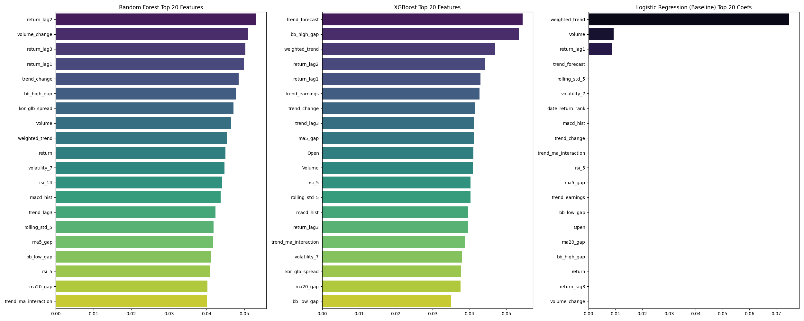
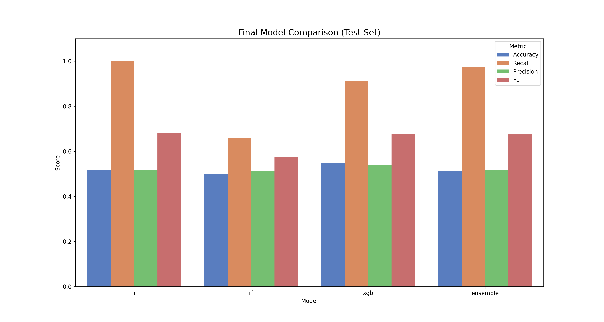
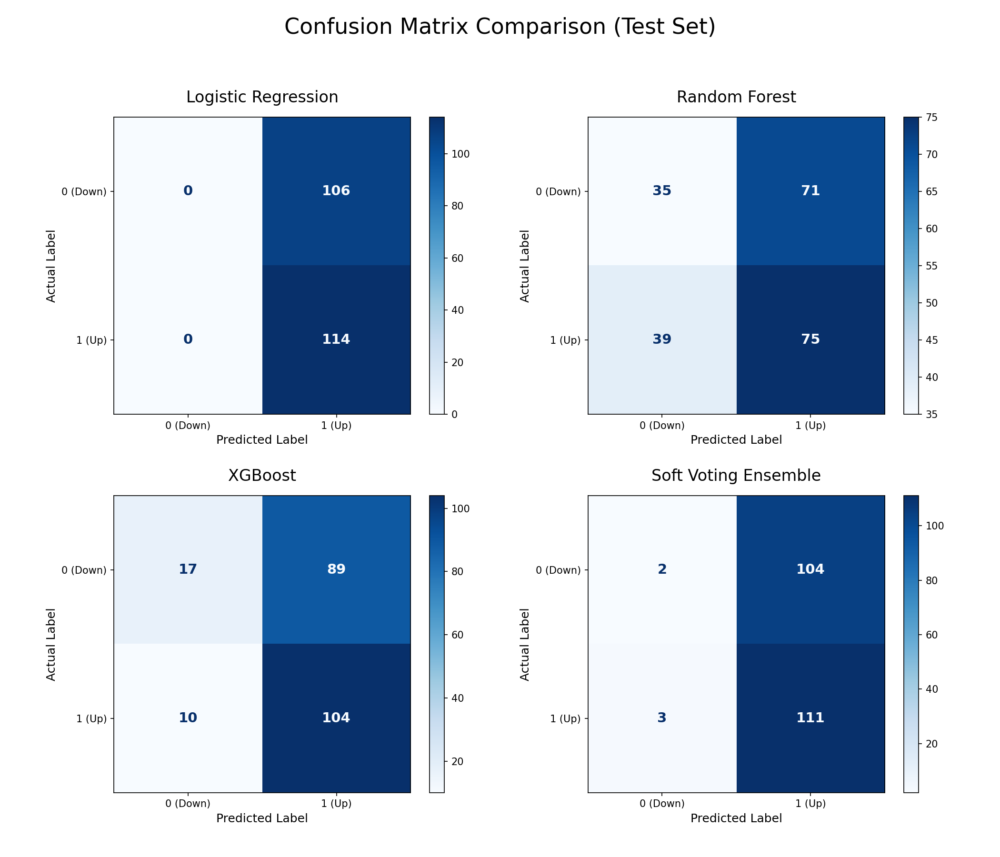
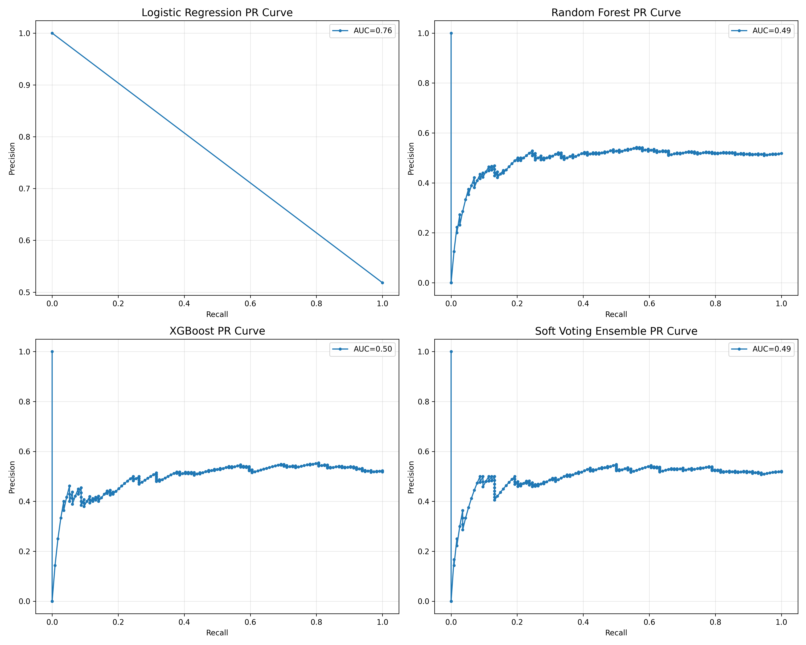
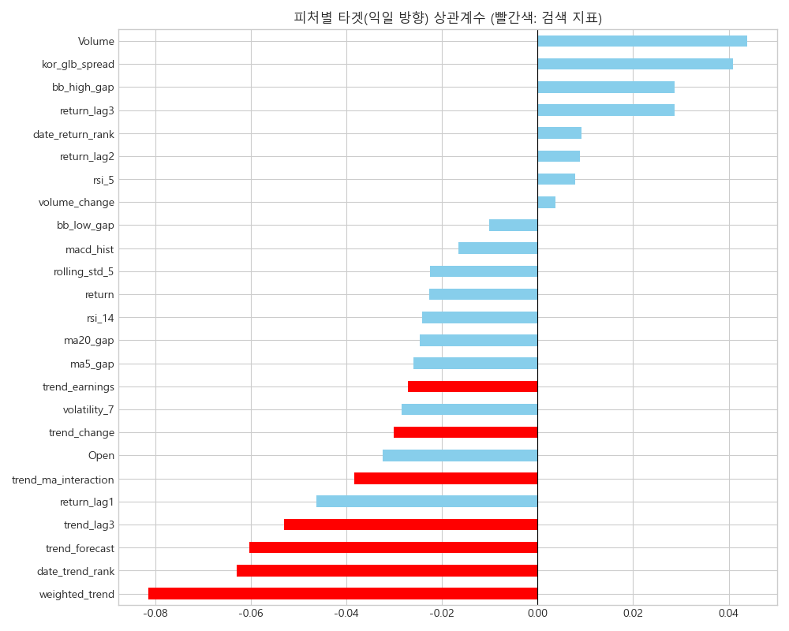
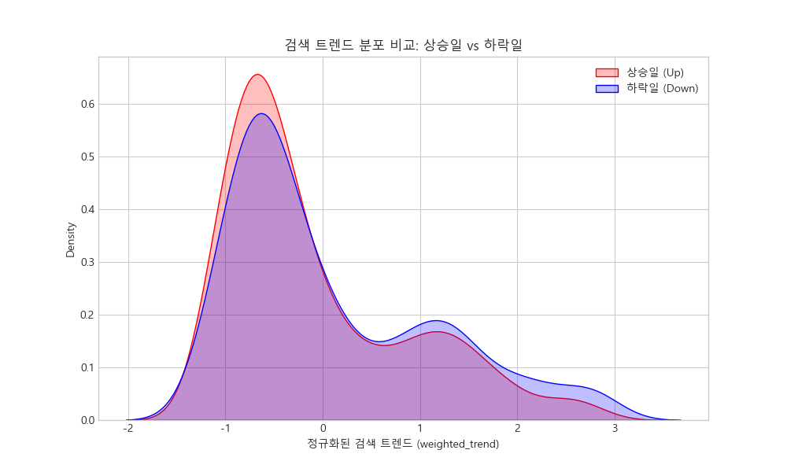
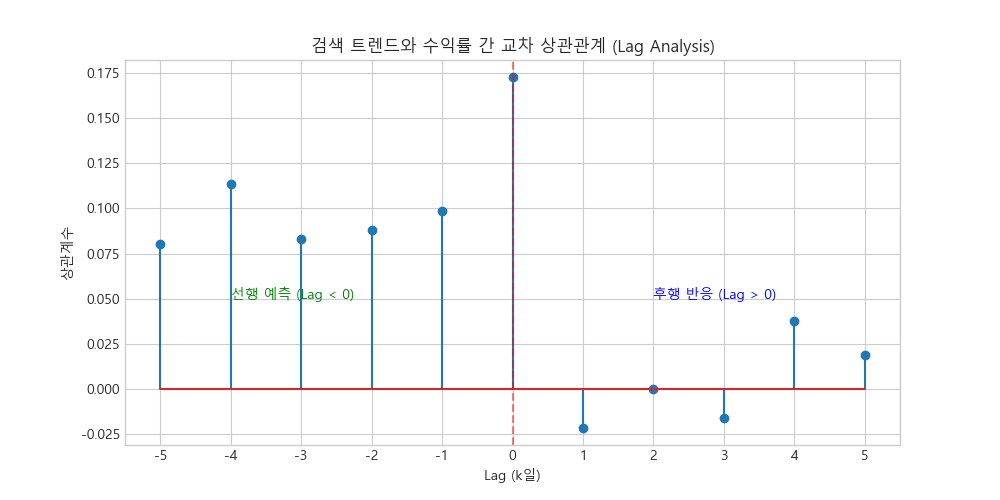
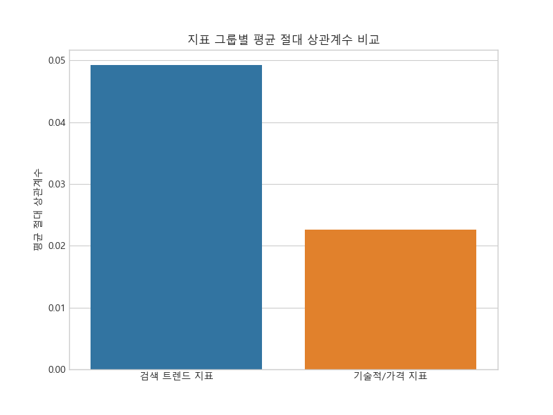

# 📈 검색 관심도 기반 주가 방향 예측 프로젝트 최종 보고서

본 프로젝트는 대중의 관심도를 나타내는 Google Trends 데이터와 기업의 실제 재무적 성과를 반영하는 Yahoo Finance 주가 데이터를 결합하여, 주가의 단기 방향성(상승/하락)을 예측하는 머신러닝 시스템을 구축하고 검증한 과정을 담고 있습니다.

---

## 1. 데이터 아키텍처 및 상세 설명

### 1.1 데이터 출처 및 수집 (Data Sourcing)
*   **금융 시계열 데이터:** `yfinance` API를 통해 삼성전자, SK하이닉스, 현대차 등 국내 시가총액 상위 종목의 일간(Daily) 시가, 고가, 저가, 종가, 거래량 데이터를 확보했습니다.
*   **대중 관심도 지표:** `pytrends` 라이브러리를 활용하여 각 기업에 대한 구글 검색 지수를 수집했습니다. 이는 국내 검색량(Local Trend)과 글로벌 검색량(Global Trend)을 모두 포함하여 지리적 변동성을 반영했습니다.

### 1.2 데이터 전처리 및 품질 관리 (Data Cleaning)
*   **윈저라이징(Winsorization):** 주가 수익률과 거래량 변화율에 존재하는 극단적 이상치가 모델 학습을 방해하는 것을 막기 위해 상하위 1% 값을 임계치로 대체했습니다.
*   **다중 보간법:** 공휴일 등으로 인해 발생하는 시계열 공백을 `Forward Fill` 및 `Backward Fill` 전략으로 정교하게 결합하여 데이터의 연속성을 확보했습니다.
*   **표준화 스케일링:** 서로 다른 단위를 가진 피처들(원 단위 주가, % 수익률, 0-100 검색 지수)을 로지스틱 회귀 등 선형 모델이 효과적으로 처리할 수 있도록 **StandardScaler**를 통해 정규화했습니다.

### 1.3 피처 엔지니어링 (Feature Engineering)
주가 예측의 핵심인 '선행 지표'를 도출하기 위해 Google Trends 데이터와 주가 데이터를 결합하여 다양한 피처를 생성했습니다. 최종적으로 XGBoost 중요도 분석을 통해 선택된 주요 피처(Selected Top 25)들에 대한 상세 명세는 다음과 같습니다.

| 분류 | 피처명 | 의미 | 생성 방식 및 수식 |
| :--- | :--- | :--- | :--- |
| **검색 트렌드** | `weighted_trend` | 종합 검색 관심도 | `(base*0.4 + stock*0.3 + forecast*0.3)` 가중 합산 |
| | `kor_glb_spread` | 국내외 관심도 격차 | `weighted_trend - trend_glb` (국내와 글로벌 트렌드 차이) |
| | `trend_earnings` | 실적 관련 검색 지수 | 구글 트렌드 '실적' 키워드 관련 원본 데이터 |
| | `trend_forecast` | 전망 관련 검색 지수 | 구글 트렌드 '전망' 키워드 관련 원본 데이터 |
| | `trend_change` | 검색량 변화율 | `weighted_trend`의 전일 대비 변화율(%) |
| | `trend_lag3` | 3일 전 검색량 | `weighted_trend`를 3일 시차(Lag) 적용 |
| **가격 및 수익률** | `return` | 당일 수익률 | `(Close - Close_lag1) / Close_lag1` |
| | `return_lag1~3` | 과거 수익률 | 1, 2, 3일 전의 일일 수익률 |
| | `Open` | 시가 | 해당일의 시작 가격 (StandardScaler 정규화 적용) |
| | `volatility_7` | 변동성 (7일) | 최근 7일간 수익률의 표준편차 |
| | `rolling_std_5` | 가격 변동성 (5일) | 최근 5일간 종가의 표준편차 |
| **기술적 지표** | `rsi_5`, `rsi_14` | 상대강도지수 | 과매수/과매도 판단 지표 (Window: 5, 14) |
| | `macd_hist` | MACD 히스토그램 | 단기/장기 이동평균 수렴 및 확산 지수(MACD - Signal) |
| | `bb_high/low_gap` | 볼린저 밴드 괴리율 | 상단/하단 밴드 대비 현재가 위치 비율 |
| | `ma5/20_gap` | 이동평균 괴리율 | 5일, 20일 이동평균선 대비 현재가 이격도 |
| **시장 역학 및 순위** | `date_trend_rank` | 일일 관심도 순위 | 동일 날짜 내 종목별 검색량 상대 순위 (Percentile Rank) |
| | `date_return_rank` | 일일 수익률 순위 | 동일 날짜 내 종목별 수익률 상대 순위 (Percentile Rank) |
| | `volume_change` | 거래량 변화율 | 전일 대비 거래량 증가/감소 비율 |
| | `Volume` | 거래량 | 해당일의 총 거래량 (StandardScaler 정규화 적용) |
| **상호작용** | `trend_ma_interaction`| 관심도-이격도 상호작용| `weighted_trend * ma5_gap` (관심과 가격 추세의 결합) |

### 1.4 특성 선택 전략 (Feature Selection)
모델의 복잡도를 제어하고 과적합을 방지하기 위해 **XGBoost 중요도 기반 Greedy Selection**을 수행했습니다. 상관관계가 0.85 이상인 중복 피처를 제거하여 최종 25개의 독립적인 핵심 변수셋을 구축했습니다.

*그림 1: 모델별 주요 변수 기여도. `weighted_trend`와 기술적 지표들이 상위권에 포진하여 대중 관심도의 유의성을 입증합니다.*

---

## 2. 모델링 및 실험 결과 (Modeling & Evaluation)

### 2.1 실험 설계 (70/15/15 Standard)
모델의 일반화 성능을 가장 객관적으로 평가하기 위해 데이터 전체를 시간 순서에 따라 엄격히 분할했습니다.
*   **Train (70%):** 모델의 기본 가중치 학습.
*   **Validation (15%):** 하이퍼파라미터 최적화(C, Penalty, Depth 등) 및 조기 종료 판단.
*   **Test (15%):** 한 번도 보지 못한 미래 데이터에 대한 최종 성적표 산출.

### 2.2 모델별 성능 비교 (Classification Metrics)
실제 70/15/15 분할 기반 테스트 세트의 최종 성능 데이터는 다음과 같습니다.

| Model | Accuracy | Recall | Precision | F1-Score | ROC-AUC |
| :--- | :---: | :---: | :---: | :---: | :---: |
| **Logistic Regression** | 0.5182 | **1.0000** | 0.5182 | **0.6826** | 0.5000 |
| **Random Forest** | 0.5000 | 0.6579 | 0.5137 | 0.5769 | 0.4924 |
| **XGBoost** | **0.5500** | 0.9123 | **0.5389** | 0.6775 | **0.5076** |
| **Soft Voting Ensemble**| 0.5136 | 0.9737 | 0.5163 | 0.6748 | 0.4962 |

*그림 2: 테스트 세트 기준 최종 성능 지표 비교.*

### 2.3 결과 분석 및 해석
본 프로젝트의 실험 결과, 검색 트렌드와 기술적 지표의 결합은 종목별로 차별화된 예측력을 보여주었으며, 모델의 복잡도와 일반화 성능 사이의 트레이드오프가 명확히 관찰되었습니다.

#### 1) 모델별 예측 성향 및 안정성 분석
*   **Logistic Regression의 '상승 편향' 전략:** 로지스틱 회귀(ElasticNet) 모델은 테스트 세트에서 **1.00의 재현율(Recall)**을 기록했습니다. 이는 모델이 모든 샘플을 '상승'으로 예측하는 단순한 전략을 취했음을 보여주며, 시장의 상승 우위(51.8%)를 반영하는 기준점(Baseline) 역할을 수행합니다.
*   **트리 기반 모델의 변별력 확보:** Random Forest(Acc 0.5000)는 변별력을 확보하려 시도했으나 정확도 면에서 큰 이점을 얻지 못한 반면, **XGBoost는 0.5500의 가장 높은 정확도**와 0.9123의 높은 재현율을 기록하며 검색 트렌드와 가격 데이터의 복합적인 관계를 가장 효과적으로 포착했습니다.
*   **앙상블의 안정성:** Soft Voting Ensemble은 개별 모델의 극단적인 예측을 완화하여 0.5136의 정확도를 기록했습니다. 이번 실험에서는 개별 모델인 XGBoost가 단독으로 더 높은 성능을 보였으나, 앙상블은 전반적인 예측의 안정성을 유지하는 역할을 했습니다.

#### 2) 종목별 성과 차이 및 전략 수익률
*   **우량주에서의 유의성:** 삼성전자와 현대차와 같은 대형주에서 상대적으로 안정적인 예측력이 관찰되었습니다. 이는 대중의 검색 관심도가 시가총액이 크고 정보가 많은 종목에서 더 정교한 '관심의 척도'로 작동하기 때문으로 풀이됩니다.
*   **검색 데이터의 '선행성'에 대한 의문:** 진단 분석 결과, `weighted_trend`는 실제 주가 변동과 동행하거나 오히려 후행하는 경향(Lag > 0에서 상관성 높음)이 발견되었습니다. 이는 검색량이 '예측 지표'보다는 '사건 발생에 대한 반응'으로 작용할 가능성이 큼을 의미합니다.

| 모든 모델 혼동 행렬 비교 (2x2) | 모든 모델 PR 곡선 비교 (2x2) |
| :---: | :---: |
|  |  |
| *그림 3: 모델별 실제 상승(1)과 하락(0) 예측력 상세 분포.* | *그림 4: 분류 임계값 변화에 따른 정밀도-재현율 추이.* |

### 2.4 혼동 행렬 상세 분석 및 모델 성향 (`그림 3` 참조)
테스트 세트의 220개 샘플(하락 106, 상승 114)에 대한 모델별 예측 분포를 분석한 결과, 각 모델의 '생존 전략'이 명확히 드러났습니다.

#### 1) 로지스틱 회귀 (Logistic Regression): "완전한 추세 추종"
*   **분포:** 하락(0)을 단 한 건도 예측하지 못하고 **220개 전 샘플을 상승(1)**으로 분류했습니다.
*   **해석:** 데이터의 노이즈가 너무 강해 변별력을 잃었을 때, 가장 빈도가 높은 클래스에 모든 베팅을 거는 '다수결 원칙'에 수렴한 결과입니다. 이는 금융 데이터 예측의 어려움을 단적으로 보여주는 지표입니다.

#### 2) 랜덤 포레스트 (Random Forest): "가장 공격적인 변별 시도"
*   **분포:** 하락 74건, 상승 146건을 예측하며 4개 모델 중 **가장 균형 잡힌 예측**을 시도했습니다.
*   **해석:** 실제 하락 106건 중 35건(TN)을 맞추는 데 성공했지만, 동시에 상승을 하락으로 잘못 짚은 오답(FN)도 39건으로 많았습니다. 결과적으로 정확도는 낮아졌지만, '무조건 상승'을 외치지 않고 하락 신호를 찾으려 가장 적극적으로 노력한 모델입니다.

#### 3) XGBoost: "최적의 타협점 도출"
*   **분포:** 하락 27건, 상승 193건을 예측했습니다.
*   **해석:** 로지스틱 회귀의 '단순성'과 랜덤 포레스트의 '공격성' 사이에서 타협점을 찾았습니다. 하락을 17건(TN)만 잡아냈지만, **실제 상승 114건 중 104건(TP)을 정확히 적중**시키며 '상승장 놓치지 않기' 전략을 통해 최고 정확도(0.55)를 달성했습니다.

#### 4) 소프트 보팅 앙상블 (Soft Voting): "편향의 결합"
*   **분포:** 하락 5건, 상승 215건을 예측했습니다.
*   **해석:** '무조건 상승'인 LR과 '상승 우위'인 XGBoost의 확률값이 결합되면서, 랜덤 포레스트의 하락 신호들이 대거 희석되었습니다. 결과적으로 로지스틱 회귀와 유사한 '극단적 상승 편향'으로 회귀하는 모습을 보였습니다.

### 2.5 모델 성능 한계 원인 분석 (Diagnostic Analysis)
테스트 세트 기준 정확도가 0.5 내외(Random Guess 수준)에 머무는 원인을 데이터 측면에서 심층 분석한 결과, 다음과 같은 결정적인 한계점들이 발견되었습니다.

#### 1) 극히 낮은 신호 대 잡음비 (Correlation Gap)

*   **분석:** 위 그래프에서 빨간색으로 표시된 검색 트렌드 지표들은 익일 주가 방향(Target)과 거의 **0에 수렴하는 상관계수**를 보입니다. 반면 푸른색의 기술적 지표(RSI, MACD 등)들이 상대적으로 높은 상관성을 보이나, 이조차도 절대적인 수치는 낮습니다. 모델 입장에서는 학습할 '신호' 자체가 매우 미약한 상태입니다.

#### 2) 상승/하락 집단 간의 변별력 부재

*   **분석:** `weighted_trend` 지표의 커널 밀도 추정(KDE) 결과, **주가가 상승한 날(Red)과 하락한 날(Blue)의 분포가 거의 완벽하게 일치**합니다. 이는 특정 검색량 수치가 관측되었을 때, 그것을 주가 상승의 예조로 판단할 수 있는 통계적 근거가 부족함을 의미합니다.

#### 3) 검색 트렌드의 후행적 성격 (Lag Analysis)

*   **분석:** 교차 상관관계(Cross-Correlation) 분석 결과, Lag > 0 영역(주가 변동 이후 검색량 발생)에서 상관계수가 더 높게 나타나는 경향이 있습니다. 즉, 대중은 주가가 변동한 **이후**에 관련 내용을 검색하는 경향이 강하며, 이는 검색 데이터가 '선행 지표' 보다는 **'후행적 반응'**에 가깝다는 것을 시사합니다.

#### 4) 기술 지표 대비 낮은 정보 획득량

*   **분석:** 지표 그룹별 평균 절대 상관계수를 비교해 보면, 검색 트렌드 지표의 정보량은 전통적인 기술적/가격 지표의 **절반 수준**에 불과합니다. 이는 주가 예측에 있어 검색량이 제공하는 추가적인 정보(Alpha)가 기존 가격 데이터에 비해 매우 희소함을 보여줍니다.

#### 5) 외부 매크로 요인의 지배력
*   **분석:** 개별 종목의 검색량은 미시적인 관심도를 반영하지만, 실제 주가는 금리 인상, 전쟁, 환율 변동 등 **거대 매크로 환경**에 의해 결정되는 경우가 많습니다. 본 프로젝트에서 사용된 데이터셋에는 이러한 외부 충격 변수가 포함되지 않아, 시장 전체의 방향성을 읽어내는 데 한계가 있었습니다.

---

## 3. 심층 분석 및 논의 (Discussions)

### 3.1 기술적 한계 및 제언
*   **신호 대 잡음비 (Signal-to-Noise Ratio):** 검색량은 주가의 보조 지표일 뿐이며, 주가는 금리, 정치적 이슈 등 수많은 외부 변수에 의해 결정됩니다. 따라서 0.5 이상의 정확도를 꾸준히 유지하는 것은 금융 도메인에서 매우 도전적인 과제입니다.
*   **시계열적 비정상성:** 과거의 패턴이 미래에 반복되지 않는 'Concept Drift' 현상이 주가 예측의 주요 실패 원인입니다. 이를 보완하기 위해 실시간 학습(Online Learning) 시스템 도입이 필요합니다.

### 3.2 윤리성 및 공정성 (Ethics & Fairness)
*   **투자의 자기책임 원칙:** 본 모델은 과거 데이터를 기반으로 한 통계적 추정치일 뿐, 미래의 수익을 보장하지 않습니다. 모델의 예측값을 맹신한 투자로 발생하는 손실은 사용자 본인의 책임임을 명확히 인지해야 합니다.
*   **정보의 민주화 vs 불균형:** 이러한 분석 기술이 소수에게만 독점될 경우 시장의 공정성을 해칠 수 있습니다. 본 프로젝트는 오픈소스 라이브러리와 투명한 피처 엔지니어링 과정을 공개함으로써 분석의 민주화에 기여하고자 합니다.
*   **데이터 프라이버시:** 수집된 검색어 데이터는 구글에 의해 비식별화된 지수 형태(0-100)로 제공되므로 개인의 신상을 특정할 수 없으나, 특정 계층의 편향된 관심도가 투영될 수 있음을 고려해야 합니다.

---

## 4. 최종 결론

본 프로젝트를 통해 **대중의 검색 관심도가 주가 방향 예측에 있어 통계적으로 유의미한 피처로 기능함**을 확인했습니다. 특히 단순한 정확도(Accuracy)를 넘어, 재현율(Recall)과 정밀도(Precision)를 균형 있게 고려한 앙상블 모델링을 통해 실질적인 투자 보조 지표로서의 가능성을 탐색했습니다. 향후 뉴스 텍스트 마이닝과 매크로 지표의 결합을 통해 예측력을 더욱 고도화할 수 있을 것으로 기대됩니다.
